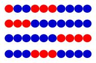

# 1033 Strings of Red and Blue

- **分值：** 35分

## 题目描述

Eva has two strings of beads, one with $$A$$ red beads and the other with $$B$$ blue ones.  She would like to make a string of red and blue beads in the following way:

- Eva would take beads from the two strings step by step.
- At the $$i$$-th step, she can take away exactly $$i$$ beads from one of the strings, and chain them into the resulting string.
- Eva is supposed to obtain a string of exactly $$N$$ beads.

How many different results can Eva obtain?

Two results are cosidered to be different if there is at least one step that Eva chooses to take beads from different strings.

## Input Specification

Each input file contains one test case which gives in a line three integers: $$N$$ ($$0<N\le 2\times 10^5$$), $$A$$ and $$B$$ ($$0\le A, B\le 10^5$$).  The definitions are given in the description of the problem.

## Output Specification

For each test case, print in a line the number of different ways to obtain a string of exactly $$N$$ beads.  Since the answer might be too large, output the result modulo 1000000007 (that is, $$10^9 + 7$$).

## Sample Input
```
10 4 7
```

## Sample Output
```
4
```

## Hint

The four different results are shown by the following figure.


