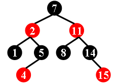
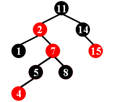
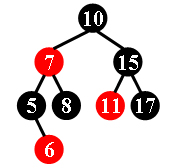

# 1035 Color the Tree

- **分值：** 35分

## 题目描述

There is a kind of balanced binary search tree named **red-black tree** in the data structure. It has the following 5 properties:

- (1) Every node is either red or black.
- (2) The root is black.
- (3) Every leaf (NULL) is black.
- (4) If a node is red, then both its children are black.
- (5) For each node, all simple paths from the node to descendant leaves contain the same number of black nodes.

For example, the tree in Figure 1 is a red-black tree, while the ones in Figure 2 and 3 are not.

|  |  |  |
| :------: | :------: | :------: |
| Figure 1 | Figure 2 | Figure 3 |

For each given binary search tree, you are supposed to tell if it is possible to color the nodes and turn it into a legal red-black tree.

## Input Specification

Each input file contains several test cases.  The first line gives a positive integer K ($$\le$$10) which is the total number of cases.  For each case, the first line gives a positive integer N ($$\le$$30), the total number of nodes in the binary search tree.  The second line gives the postorder traversal sequence of the tree.  All the numbers in a line are separated by a space.

## Output Specification

For each test case, print in a line `Yes` if the given tree can be turned into a legal red-black tree, or `No` if not.

## Sample Input
```
3
9
1 4 5 2 8 15 14 11 7
9
1 4 5 8 7 2 15 14 11
8
6 5 8 7 11 17 15 10
```

## Sample Output
```
Yes
No
Yes
```
